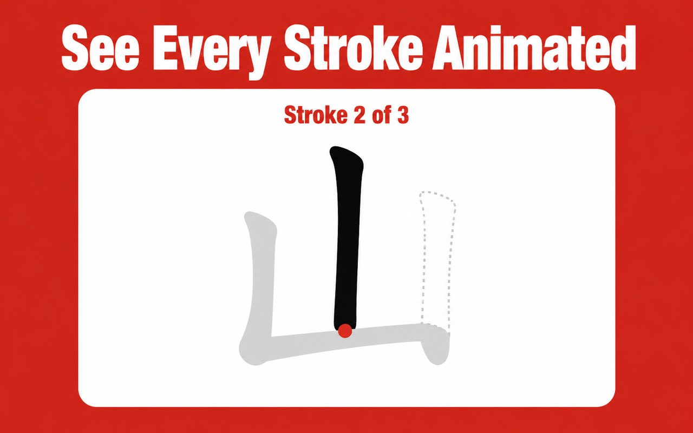

# Chinese Character Stroke Order



Chrome extension (Manifest V3) plus the web app it launches, live on the
[Chrome Web Store](https://chromewebstore.google.com/detail/ddepakkdkpoeofoledepfohnajcehkgp)
with real installs. Animated stroke order for any Chinese character, plus
a practice mode that quizzes you on drawing it yourself.

## Two parts, one product

`extension/` is a thin launcher, built the same way as this portfolio's
other two Chrome extensions
([chinese-to-pinyin](https://github.com/uranbekanarbaev/chinese-to-pinyin),
[chinese-text-to-speech](https://github.com/uranbekanarbaev/chinese-text-to-speech)):
a floating on-page widget, shown only on pages with Chinese text, and a
right-click "Stroke Order" context menu, both opening the character in the
web app. There's no content-script-side rendering to keep in sync with a
second copy of a stroke-order engine.

`frontend/` is the actual tool: search by character or by pinyin, animated
stroke-by-stroke playback via [HanziWriter](https://hanziwriter.org/), a
simplified/traditional toggle, adjustable speed, and a practice mode that
quizzes stroke-by-stroke drawing with mistake tracking and a score.

## Code worth reading

[`frontend/js/lib/char-lookup.js`](frontend/js/lib/char-lookup.js) is the
search box's logic. It accepts a Chinese character or a pinyin syllable in
the same input, auto-detected, with tone-diacritic normalization: `nǐ`,
`NǏ`, and `ni` all resolve the same way. It also handles the
simplified/traditional conversion layer and the practice-mode scoring.
Pulled out of `app.js`/`practice.js` so it's unit-tested rather than only
reachable by typing into the search box.

[`extension/lib/amplitude.js`](extension/lib/amplitude.js) carries
`amp_did` on every extension-opened tab, so an install-to-first-lookup-to-
uninstall funnel ties back to one user across the extension and website.
The uninstall URL didn't carry it before this fix, because
`chrome.runtime.setUninstallURL()` only accepts a plain string; appending
an async-fetched device ID needs routing through a callback (`getDeviceId`),
the same way `openTab` already does. Applied consistently across the two
sibling extensions in this portfolio.

## Testing

```bash
npm install
npm test
```

18 tests against the extracted search/practice logic, run with real inputs,
including the "Chinese char vs. pinyin, auto-detected" branch and every
tone-diacritic class. CI runs the suite on every push, see
[`.github/workflows/ci.yml`](.github/workflows/ci.yml).

## Loading it locally

```
chrome://extensions → Developer mode → Load unpacked → select extension/
```

The web app (`frontend/`) is static. Serve it with anything
(`npx serve frontend`) or open `frontend/index.html` directly.

## Stack

Manifest V3 · [HanziWriter](https://hanziwriter.org/) (SVG stroke
rendering + quiz mode) · vanilla JS · Amplitude · Jest · GitHub Actions
